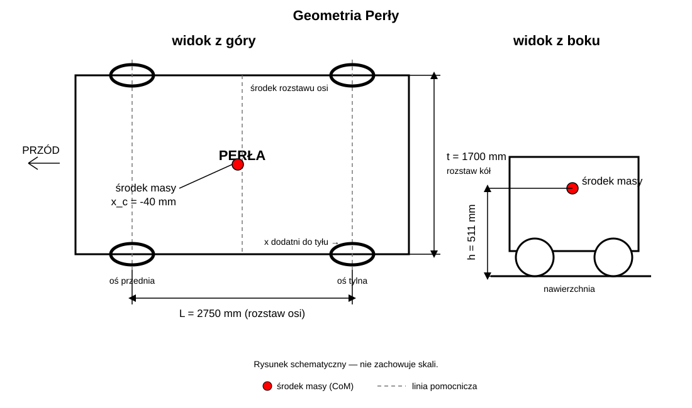

# Torque vectoring w C

[English](README.md) · **Polski**

Program rozdziela żądanie kierowcy między lewe i prawe koło tylnej osi. Sterownik
nie ustawia pozycji maglownicy. Przy każdym wywołaniu **otrzymuje aktualny pomiar
z czujnika maglownicy** razem z informacją, czy pomiar jest dostępny. Wejścia to:

- wychylenie maglownicy `[mm]` — dodatnie w lewo, ujemne w prawo,
- prędkość jako liczba całkowita `[mm/s]`,
- nacisk pedału jako liczbę całkowitą `0–256`.

Zwraca dwie całkowite komendy: dla lewego i prawego tylnego koła. Przepływ jest
prosty: program zamienia wychylenie maglownicy na promień, oblicza rozkład
obciążenia, a następnie skaluje żądanie pedału osobno dla obu kół.

Pomiar maglownicy jest interpretowany następująco:

| Dane otrzymane z czujnika | Działanie programu |
|---|---|
| brak aktualnego pomiaru | oba koła dostają wartość pedału |
| dokładnie `0 mm` | jazda prosto: oba koła dostają wartość pedału |
| od `+1` do `+70 mm` | skręt w lewo i aktywny torque vectoring |
| od `-1` do `-70 mm` | skręt w prawo i aktywny torque vectoring |
| wartość powyżej `±70 mm` | pomiar poza obsługiwanym zakresem; zwracany jest błąd |

Dokładnie `0 mm` jest osobnym, poprawnym pomiarem oznaczającym pozycję środkową
maglownicy. Dla `±1–4 mm` program także wykonuje obliczenia. W tym obszarze używa
ekstrapolacji funkcji `R = 507 / |x|`, ponieważ punkty pomiarowe zaczynają się od
`5 mm`. Dzięki temu podział momentu zmienia się płynnie w pobliżu jazdy prosto.

Parametry bazowe pojazdu: masa `850 kg`, wysokość środka ciężkości `0,511 m`,
przesunięcie środka ciężkości względem środka rozstawu osi `-0,040 m`, rozstaw
osi `2,750 m`, rozstaw kół `1,700 m` i współczynnik tarcia `0,8`.

<p align="center">
  
</p>

## Konfiguracja zakresu

Domyślnie pedał i komendy kół używają tego samego zakresu `0–256`. Zmienia się
go w pliku `c_implementation/config.h`:

```c
#define TV_CONFIG_COMMAND_MIN 0
#define TV_CONFIG_COMMAND_MAX 100
```

Po tej zmianie wejście pedału i oba wyjścia działają w zakresie `0–100`.
`command_min` oznacza brak żądanego momentu, a `command_max` pełne żądanie.
Wartości spoza skonfigurowanego zakresu zwracają `TV_INVALID_ARGUMENT`.
W tym samym pliku znajdują się współczynniki do późniejszej korekcji promienia:

```c
#define TV_CONFIG_RADIUS_CORRECTION_PERMILLE 1000U
#define TV_CONFIG_RADIUS_CORRECTION_OFFSET_MM 0
```

`1000` oznacza mnożnik `1,000`; np. `980` oznacza `0,980`.

## Uruchomienie

```sh
make
./build/torque-vectoring 70 5000 128
make test
```

Bez dostępnego pomiaru maglownicy podaje się tylko prędkość i pedał:

```sh
./build/torque-vectoring 5000 128
```

Przykładowy wynik dla skrętu w lewo:

```text
Torque vectoring:   active
Rear left command:  72
Rear right command: 184
```

## Na czym polega problem


Na zakręcie koło zewnętrzne pokonuje dłuższą drogę i jest mocniej dociskane do
drogi. Koło wewnętrzne jest odciążane. Dlatego obu kołom nie należy zawsze
zadawać identycznej wartości.

## Obliczenia

Wychylenie `x` jest przeliczane ciągłą funkcją dopasowaną do pomiarów z wykresu:

```text
R_m = 507 / |x_mm|
```

W implementacji całkowitoliczbowej jest to równoważne `R_mm = 507000 / |x_mm|`.

Znak `x` określa kierunek skrętu. Obsługiwany niezerowy zakres wejściowy to
`1–70 mm`; wartości większe zwracają `TV_RACK_OUT_OF_RANGE`. Dla `1–4 mm`
funkcja jest ekstrapolowana. Punkty źródłowe zaczynają się od `5 mm`:

| Wychylenie [mm] | Promień [mm] | Wychylenie [mm] | Promień [mm] |
|---:|---:|---:|---:|
| 5 | 102525 | 40 | 12167 |
| 10 | 50341 | 45 | 10819 |
| 15 | 33411 | 50 | 9660 |
| 20 | 24958 | 55 | 8687 |
| 25 | 19851 | 60 | 7858 |
| 30 | 16454 | 65 | 7120 |
| 35 | 14014 | 70 | 6492 |

Ta sama funkcja, punkty pomiarowe i przykładowa implementacja algorytmu znajdują
się w notebooku `old/analiz.ipynb`.

```text
a_y = v² / |R|
F_y = m · a_y
```

Przybliżone przeniesienie obciążenia:

```text
ΔF_z = F_y · h / t
F_z,inner = F_z,rear/2 - ΔF_z
F_z,outer = F_z,rear/2 + ΔF_z
```

Program wyznacza udział obu kół z ich dostępnego momentu `μ · F_z · r_w`.
Wartość pedału jest poziomem bazowym dla każdego koła podczas jazdy prosto.
Na zakręcie komenda koła wewnętrznego maleje, a zewnętrznego rośnie. Wynik jest
zaokrąglany i ograniczany do zakresu z konfiguracji. Po przekroczeniu limitu
`F_y > μmg` obie komendy przyjmują wartość `command_min`.

Jeżeli przy mocno wciśniętym pedale jedna z komend przekroczyłaby `command_max`,
program skaluje **obie** wartości tym samym współczynnikiem. Zachowuje dzięki
temu wyliczoną proporcję między kołami. Łączne żądanie momentu zostaje wtedy
zmniejszone, ponieważ ważniejsze jest nieprzekroczenie zakresu i zachowanie
podziału momentu.

## Implementacja STM32

Ścieżka sterująca nie używa `float`, `double`, `pow()`, `hypot()` ani biblioteki
`libm`. Cała arytmetyka, łącznie z wynikami pośrednimi, jest 32-bitowa: operacje
64-bitowe na rdzeniach 32-bitowych są emulowane programowo (`__aeabi_uldivmod`
i podobne), więc zamiast nich równania zostały przeskalowane, a udokumentowane
zakresy parametrów są sprawdzane. Jednostki to `mm`, `mm/s`, `mm/s²` oraz
promile. Dzielenie jest zaokrąglane do najbliższej liczby całkowitej.

Masa, współczynnik tarcia i promień koła skracają się przy liczeniu proporcji
momentu. Współczynnik tarcia nadal służy do wykrywania przekroczenia przyczepności.
Maksymalna akceptowana prędkość jest ustawiona przez
`TV_CONFIG_MAX_SPEED_MMPS`.

Kompletna instrukcja dodania plików do STM32CubeIDE, tabela jednostek i przykład
pętli sterującej znajdują się w
[`docs/STM32_INTEGRATION_PL.md`](docs/STM32_INTEGRATION_PL.md). Aktualna ścieżka
nie korzysta z `math.h` ani `arm_math`; CMSIS-DSP nie jest wymagane.

Publiczne typy i funkcje mają komentarze Doxygen. Dokumentację HTML można
wygenerować poleceniem `doxygen Doxyfile`.

Poprzednia implementacja `double` znajduje się w
`old/c_implementation_double/`. Porównanie `1 268 784` przypadków nie wykazało
żadnej różnicy statusu przyczepności. Maksymalna różnica wyjścia wyniosła jedną
jednostkę komendy, a maksymalny względny błąd promienia `0,00572%`. Szczegóły są
w `old/c_implementation_double/COMPARISON.md`.

## Pliki

- `c_implementation/torque_vectoring.h` — typy i publiczne funkcje,
- `c_implementation/config.h` — zakres wejścia i wyjść,
- `c_implementation/torque_vectoring.c` — obliczenia,
- `c_implementation/main.c` — wejście i wyjście programu,
- `c_implementation/test_torque_vectoring.c` — testy.

To uproszczony model edukacyjny. Nie uwzględnia m.in. koła tarcia opony,
dynamiki przejściowej, charakterystyki silników, zmian geometrii przy ugięciu
zawieszenia ani charakterystyki opony. Przewidywana podsterowność nie jest teraz
modelowana osobno. Po testach auta funkcję promienia można skorygować przez
`TV_CONFIG_RADIUS_CORRECTION_PERMILLE` i `TV_CONFIG_RADIUS_CORRECTION_OFFSET_MM`.
